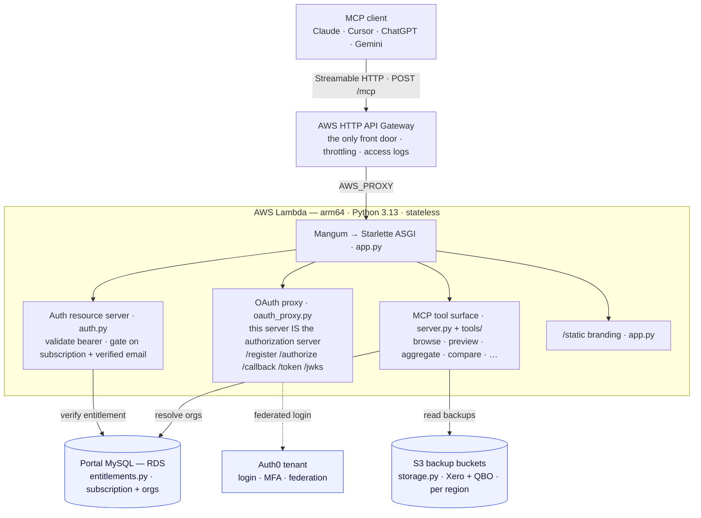

# WOW AISuite — MCP Server

A stateless, remote **Model Context Protocol (MCP)** server that lets a
subscriber explore their own **Xero** and **QuickBooks** backups in plain
language from Claude, Cursor, or any other MCP client. It runs as a single AWS
Lambda behind an HTTP API, authenticates users through Auth0, enforces
per-subscriber entitlements against the portal database, and reads backup files
directly from S3.

> Open source under the **MIT License** — see [LICENSE](LICENSE).
> © 2026 WOW Backup & Restore Ltd.

---

## Table of contents

- [What it is](#what-it-is)
- [Architecture](#architecture)
- [How a login works](#how-a-login-works)
- [Repository layout](#repository-layout)
- [Core modules](#core-modules)
- [The tools clients see](#the-tools-clients-see)
- [Data model](#data-model)
- [Configuration](#configuration)
- [Local development](#local-development)
- [Deployment](#deployment)
- [Connecting a client](#connecting-a-client)
- [Security model](#security-model)
- [Known gaps & roadmap](#known-gaps--roadmap)

---

## What it is

- **Remote and stateless.** Nothing is held between requests — any Lambda
  instance can answer any call. Scale it with a plain round-robin; there are no
  sticky sessions and no shared store.
- **Zero-secret clients.** A client holds no API key and no connection string.
  The user signs in through their browser once; tokens are issued by this server.
- **Tenant-scoped by construction.** The S3 path's user segment comes from the
  verified token, never from a tool argument, so one subscriber can never read
  another's data.
- **Two accounting sources.** Xero and QuickBooks backups are exposed through the
  same tool surface, labelled per organisation.

## Architecture



Key properties:

- **The gateway is the only route in.** The deployment removes any Lambda
  Function URL, so there is no unthrottled, unlogged bypass.
- **The OAuth proxy makes this server its own authorization server.** Clients do
  Dynamic Client Registration, PKCE, `/authorize` → Auth0 → `/callback` →
  `/token` here; Auth0 is federated behind the scenes as one first-party app.
- **Self-issued access tokens** are RS256 JWTs this server signs and validates
  against its own JWKS — no per-request call to Auth0.

## How a login works

1. The client `POST`s to `/mcp` with no token and gets **401** plus an
   RFC 9728 `resource_metadata` pointer.
2. It fetches `/.well-known/oauth-protected-resource`, discovers this server as
   the authorization server, and registers via `/register` (DCR).
3. It sends the user to `/authorize`. We seal the request into a signed `state`
   and redirect to **Auth0**, federating as the upstream first-party app. The
   redirect carries `prompt=login` (set by `OAUTH_AUTHORIZE_PROMPT`), so Auth0
   re-authenticates on every connect rather than silently reusing a browser SSO
   session — a disconnected user is never signed back in as the previous account.
4. Auth0 authenticates the user (password / Google / Xero / Intuit / passkey,
   MFA per policy) and calls back to `/callback`. We unseal `state`, exchange
   the code with Auth0, and capture the user's identity + an **encrypted Auth0
   refresh token** (so our own logout can revoke the Auth0 session too).
5. We mint a short-lived proxy **authorization code** (an HS256-sealed JWT, 60 s
   TTL) and redirect back to the client's loopback.
6. The client calls `/token`; we return a **self-issued RS256 access token**
   carrying the verified email and granted scopes.
7. Every subsequent `/mcp` call is validated offline, then gated on an **active
   subscription** and a **verified email** before any tool runs.

## Repository layout

```
src/s3_mcp/        The server: ASGI app, auth, OAuth proxy, entitlements, storage,
                   and the tool surface — the shared engine and mcp instance in
                   _core.py, one module per tool under tools/, the report
                   flattener in _reports.py.
npm/               @wow-aisuite/mcp-server — the stdio↔remote launcher clients
                   put in their config. Bridges to the remote endpoint.
mcpb/              Claude Desktop Extension (.mcpb) — one-click, branded install
                   that wraps the npm launcher. Built by build_mcpb.sh.
branding/assets/   Image assets served from /static (the landing-page swirl and
                   the brand logos).
docs/              Customer-facing connection guide (INSTALL.md).
tests/             Unit tests: the entitlement gate, path isolation, the backup
                   window, and the reader / report-flattener behaviour.
.env.example       Every setting, documented. Copy to .env for local runs.
```

## Core modules

| Module | Responsibility |
| --- | --- |
| `app.py` | ASGI entrypoint. Wires the SDK's Streamable-HTTP app, adds the well-known/OAuth/static routes, sets DNS-rebinding host allow-list, wraps everything in the auth middleware. Runs **stateless**. |
| `lambda_handler.py` | Mangum adapter — turns the ASGI app into a Lambda handler. |
| `auth.py` | OAuth 2.0 **resource server**: validates the bearer token, publishes RFC 9728 protected-resource metadata, and enforces the subscription + verified-email gate. |
| `oauth_proxy.py` | OAuth 2.1 **authorization server** fronting Auth0, statelessly (DCR, PKCE, authorize/callback/token/jwks, refresh with rotation, logout-chained revocation). |
| `entitlements.py` | Resolves a verified identity to the organisations they may see. Queries the portal MySQL across **multiple databases** (live + staging) and merges **Xero + QuickBooks** organisations. |
| `storage.py` | S3 access scoped to one user. Lists backups/files and reads objects; honours the per-source path layout (QBO nests files under an extra `data/` segment). |
| `_core.py` | The shared engine: the `mcp` instance and handshake (name, title, icon, version, changelog resource), the S3 workspace / DuckDB dataset loader, the column/`where`/aggregate query layer, and format helpers. Everything the tools stand on. |
| `tools/` | One module per tool (`browse`, `reading`, `aggregate`, `uncategorized`, `compare`, `live`, `session`), each registering on the shared `mcp`. |
| `server.py` | Thin aggregator — imports `_core` and every tool module (registering them) and re-exports `mcp`, so `app.py` and the tests are unaffected by the split. |
| `_reports.py` | The report flattener (below): turns Xero/QuickBooks statement and general-ledger structures into flat rows at load time. |
| `settings.py` | Pydantic settings — everything from the environment, nothing baked in. Per-country buckets and regions, multi-DB list, feature flags. |
| `ratelimit.py` | Per-caller token-bucket rate limiting (each instance carries its own buckets). |
| `xero_live.py` | Optional live Xero read path (refresh at identity.xero.com, call api.xero.com). Feature-flagged; see roadmap. |

## The tools clients see

Seven tools, each a `verb_noun` name with no product prefix or vendor baked
in — the accounting platform is a parameter, not part of the name.

| Tool | What it does |
| --- | --- |
| `browse` | Drill down: organisations you can access (labelled `[Xero]` / `[QuickBooks]`), then a chosen organisation's dated backups (flagging stale feeds), then the files inside one backup with row counts. |
| `preview_file` | A file's shape — columns, types, row count — and a page of rows; project fields with `columns=`, narrow with a boolean `where=`, page with `offset`, `rows=0` for the schema alone. `raw=true` bypasses report flattening to inspect a report's own nested shape. |
| `aggregate_file` | Aggregate within a file (count/sum/avg/min/max, or several at once via `measures`), grouping by nested paths and bucketing dates for trends; filter with a boolean `where` (AND/OR/NOT and parentheses); reconcile against a second file by key; or sweep across organisations with `organisations="*"` (with cross-platform column aliasing). |
| `find_uncategorized_balances` | The net unresolved balance sitting in catch-all / uncategorised accounts — one organisation, or the portfolio with `organisations="*"`. |
| `compare_file_versions` | What changed in one file between two backup dates — added, removed and changed rows, with before→after values. On a report file this is an **account-level (or posting-level) change journal**. |
| `get_live_data` | Read an organisation's data live from its accounting platform (`source`, Xero today) rather than from the backups. |
| `logout` | End the session and revoke it upstream. |

Results are deliberately compact text: large tables are aggregated or handed
back as a download link rather than spent as tokens.

**Report flattening.** The financial reports — `trial_balance`, `balance_sheet`,
`profit_and_loss`, `cash_flow`, and QuickBooks `general_ledger` — are stored as
one deeply nested object (a raw preview is ~210 KB). `_reports.py` flattens them
at load time into a virtual table, so every tool above reads them as ordinary
rows with **no new tool and no schema change**: statements become
`[section, account, account_id, row_type, <value columns>]`, the ledger one row
per posting keyed by transaction and account. That single flattening layer is
what makes reports previewable, summable (`where row_type=account`/`posting`),
and — via `account_id` / `posting_id` — diffable as a true change journal. On
Xero, `general_ledger` reads the (already-flat) `journals` files.

## Data model

**S3 layout.** `s3://{bucket}/{email}/{organisation}/{backup_date}/{file}` for
Xero; QuickBooks nests one level deeper under `{backup_date}/data/{file}`. The
bucket is chosen per organisation from its country code — backups live in the
region they belong to. `.jsonl` files carry structure (what the tools read);
`.xlsx` files are for humans.

**Entitlements.** A subscriber is resolved from the portal MySQL database. The
resolver iterates every configured database (e.g. `app_live`, `app_staging`),
matches the verified email, checks `subscription_status`, and merges the `xero`
and `qbo` organisations it finds, tagging each with its source and storage
location.

## Configuration

Everything is environment-driven — see **[.env.example](.env.example)** for the
complete, documented list. The essentials:

- **Identity** — `PUBLIC_URL`, `AUTH0_DOMAIN`, `AUTH0_AUDIENCE` (must equal
  `{PUBLIC_URL}/mcp`, the `resource` clients validate).
- **OAuth proxy** — `OAUTH_PROXY_ENABLED`, upstream client id/secret, and the
  RSA `OAUTH_PROXY_SIGNING_KEY` (the token-signing + kill-switch key).
- **Entitlements** — `ENTITLEMENT_BACKEND=mysql`, `MYSQL_*`, and
  `MYSQL_DATABASES` (comma-separated, for multi-DB resolution).
- **Storage** — per-country `S3_BUCKET_NAME_*` / `AWS_REGION_*`, plus the QBO
  buckets and `QBO_BACKUPS_ENABLED`.

> No real secret belongs in this repo. `.env` and `.env.portal` are git-ignored;
> in production the values live in Lambda environment / Secrets Manager.

## Local development

```bash
python3.13 -m venv .venv && source .venv/bin/activate
pip install -e .
cp .env.example .env                  # then fill in real values (never commit .env)

# run the server locally (uvicorn, hot reload)
python -m s3_mcp.app                  # serves on http://localhost:8000

# tests
pytest tests/
```

## Deployment

The server is designed to run as a single stateless AWS Lambda behind an HTTP
API Gateway (it is packaged with **Mangum**), but it is a plain Starlette ASGI
app and will run under any ASGI server. The internal build, deployment, and
operational scripts used for the hosted service are not part of this public
repository.

The Claude Desktop Extension is built with `bash mcpb/build_mcpb.sh`, which wraps
the npm launcher in `npm/` into a one-click `.mcpb` bundle.

## Connecting a client

Full guide: **[docs/INSTALL.md](docs/INSTALL.md)**. In short:

- **Claude Code** — `claude mcp add --transport http wow-aisuite <endpoint>`.
- **Claude Desktop / claude.ai** — Settings → Connectors → Add custom connector →
  paste `<endpoint>`.
- **ChatGPT** — Settings → Connectors → Advanced → Developer mode → add a custom
  connector by URL.
- **Gemini CLI** — add the endpoint under `mcpServers` in `~/.gemini/settings.json`
  with the `httpUrl` key.
- **Config-file clients** — the npm launcher bridges stdio to the remote:
  `{ "command": "npx", "args": ["-y", "@wow-aisuite/mcp-server"] }`.
- **One-click, branded** — install `wow-aisuite.mcpb` in Claude Desktop.

The endpoint is baked into the launcher on purpose: it moves by publishing a new
version, not by editing every customer's config.

## Security model

- **No secrets in the repo.** Enforced by `.gitignore`; verified before the
  initial commit. Live values live in the environment / Secrets Manager.
- **Least privilege.** The Lambda role can only *read* the named backup buckets.
  Auth0 Management scopes are cut to exactly what the server uses.
- **Tenant isolation is structural.** The user segment of every S3 path is taken
  from the verified token — never an argument — and is covered by
  `tests/test_path_isolation.py`.
- **Gate before work.** `tests/test_entitlement_gate.py` guards the rule that no
  tool runs without an active subscription and a verified email.
- **One front door.** API Gateway only; Function URLs are removed on deploy.

## Known gaps & roadmap

- **Client icon rendering** — the server advertises its brand icon per spec, but
  custom-connector icon rendering is still a client-side gap; the `.mcpb` route
  shows it today.
- **Live Xero** (`xero_live.py`) — built against staging; blocked on Xero app
  credentials and a DB write-back for rotated refresh tokens before production.
- **Secret hygiene** — move `MYSQL_PASSWORD` and the signing key from Lambda env
  into a secrets manager; rotate anything ever exposed.

---

### Developer

**Akshat Gurnani** — architecture, implementation, and deployment.
Built for WOW Backup & Restore Ltd.
